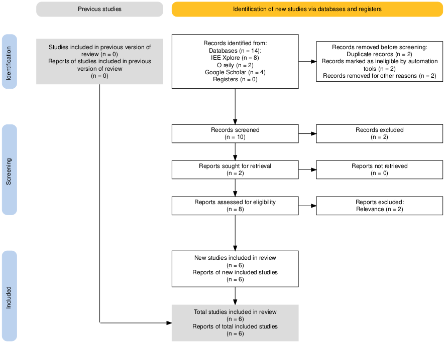

## Executive Project Summary
There is an expectation of privacy and security for marketed network devices. Routers, modems, switches, IoT devices, and other smart home devices are expected to keep PII (Personal Identifiable Information) secure. Although there are industry standards for information security, such as NIST and SOC2, routers often rely on consumers’ knowledge to apply the proper security configuration. Relying on consumers’ knowledge can lead to poor data governance, privacy concerns, vulnerabilities, and insecure networks. It is imperative that the best practices for data governance are in place to protect users’ data and keep their networks private.

## Goals and Objectives
This research will look to see how best practices for data governance can be automated improved during the onboarding process of the devices as well as explore a way to make the process seamless to prevent user misconfiguration and minimize the reliance on the user’s knowledge. The objectives are as follows:
- **Reduce User Dependency** 
	- Minimize the reliance on the user's knowledge for applying proper security settings to routers.
- **Increase Network Security** 
	- Harden router security configurations to enforce the strongest network security.
- **Protect Users Privacy**
	- Harden privacy settings to ensure data is private.
- **Standardize Best Practices** 
	- Define success criteria for best practices out of the box based off of current best practices. 

The proposed approach would require reviewing a router device and researching a way to make it more secure such as allowing automatic firmware updates, setting configuration of the router to be the most secure settings, requiring default credentials to be changed, and strong password enforcement, more user friendly interface.

## Merit
The expected result of this research would significantly lessen the stress and end user experiences when they must set up a new router as well as grant them peace of mind that the device they set up is secure, and their network is private. This research could help to change the way routers handle data governance and potentially make good data governance out of the box a new standard for routers.
 

## Proposed Project Timeline

 

## Risk List
|Risk name (value)  | Impact     | Likelihood | Description |
|-------------------|------------|------------|-------------|
|Licensing/paywalls (63) | 7 | 9 | Licensing/paywalls may prohibit us from performing a technical analysis. Cybersecurity tools often require paid licensing. Even if there are free tools to simulate a network topology in the technical analysis, it may not have the features necessary to cover our use cases. We need to simulate a virtual environment to find hardening methods for our networking devices. Without paid tools, research into hardening methods may present researching roadblocks. Licensing could also prohibit our research in other ways, such as the researching the firmware of home network devices. |
|Network delivery performance issues (20) | 10 | 2 | The finalized PoC (proof of concept) may have performance issues. To preface, the team is still defining the scope of the PoC. At minimum, it will be a simulated network with the configurations of our proposed methodology. As of now, the planned PoC is going to be simulated virtually. The idea is that its hardening topology could be implemented into a home networking device with confidence. The problem is that there is a diverging market in network delivery. Our PoC can be future proof only if it is polymorphic to fiber, 5G, and StarLink compatibility. The extra memory dedicated to security configurations may also come at a sacrifice to packet delivery, causing outages and latency for our PoC. |
|Missed deadline (18) | 6 | 3 | Deadlines might be missed. A natural consequence of any group project is member avilability. Life circumstances can shift focus away from this class, causing deliverables to miss their deadlines. |
|Firmware EULAs (16) | 2 | 8 | Legal restrictions may prevent us from researching firmware of existing network devices. It is unclear what questions can be answered through white papers alone. The network topology of marketed home network devices may only be discoverable through the decompiling of their firmware. The team is fully dedicated to upholding the law and honor all EULAs. Because of this, the team may hit legal roadblocks when researching home network firmware. |
|Low user satisfaction (10) | 2 | 5 | The finalized website may have low user satisfaction. Even with detailed explanations, the hardening methods presented on the website may be too technical for those without IT experience. The risk is that website will require a level of technical knowledge that confuses and frustrates our target audience of everyday home network users. Low satisfaction would be predictable, but not based on any empirical evaluations because the team has no plans for collecting user feedback. |

## Project Methodology
### Literature Review
Our literature review followed a **thematic analysis method** with a systematic approach to identify, analyze, and synthesize relevant literature on consumer networking device security. This involved a comprehensive review of academic publications, technical documentation, and industry standards published between **2002 and 2023**.

#### **PRISMA Technique**
We used PRISMA technique for screening the research papers and to achieve clear inclusion/exclusion criteria.

    

#### Documentation
**[View Annotated Bibliography](References_Citations)** 

**[View Literature Review](Research_Materials/Literature-review.docx)**  

## Technical Plan
### Summary
The technical deliverable for this project will be a website containing the results of our research and analysis of common consumer routers. This website will contain easily readable information regarding our research 
with the intent of informing consumers of potential security flaws that may exist in their network. Additionally, this website will contain the results of our analysis on a sample of common consumer routers which are supported 
by major Internet Service Providers (ISPs) in the United States. The details of our analysis will be readily available, and it will involve a developed list of criteria sourced from our research. The purpose of this deliverable 
is to provide an objective, informative, and useful website to bolster security literacy amongst consmers. 

### Development of Evaluation Criteria
Parallel to the research plan, we will begin creating our evaluation criteria. Our evaluation criteria will take the results of the research plan to identify core aspects of router security, usability, consumer privacy, and value. For example, 
core aspects of "security" could include patching cadence, manufacturer responses to vulnerabilities, and secure defaults out of the box. The criteria will be scoped to cover essential components of each category, but they will also be refined a limited 
scope to avoid breaching the project's timeline.

### Data Collection and Testing
Once we have properly defined our evaluation criteria, we can begin our data collection process. Our process will roughly follow these stages:
1. Selection of Routers
2. Evaluation of Router Specifications
3. Evaluation of Router GUI
4. Scoring Based on Findings
5. Final Consensus

The selection of routers will be done via publicly available "supported routers" lists from the most common ISPs in the United States. A sample of consumer routers will be chosen from each price point and internet connection type. If the data collection and 
analysis portion of this project proves too time consuming, routers from the most widely adopted connection types will be prioritized. The evaluation of router specifications and GUIs will be done via publicly available manuals and specification sheets. Devices 
which do not support this evaluation method will not be prioritized for analysis. The data gathered from these manuals and sheets will be compared against our criteria. If needed, the criteria may be updated if it proves insufficient in covering any gaps which may 
be uncovered during our analysis. From our comparison, all routers will receive a final "grade" that will be reviewed by each member of our research group.

### Development of Website
The final, refined results of our research will be displayed on a publicly available website. This website will contain the results of our analysis, provide insights into consumer router security, and present helpful tips for securing a home network. The website will 
be coded and presented using a not-yet chosen front-end framework. Since the website will contain mostly static images and text, it will not require a back-end development platform. The website will be created with the consumer in mind, and it intends to be simple and informational. 

### Final Results and Review
Until the weeks before termination of our project timeline, our research, analysis, and website development will be in constant refinement. Our project aims to present objective and informative insights into the current state of consumer router security and privacy. In order to achieve 
this end, our criteria and determinations must be continually re-evaluated when new evidence or insights are brought to light. 

## Resources Needed
|Resource  | Dr. Hale needed? | Investigating Team member | Description |
|-------------------|---------|---------------------------|-------------|
|Shared Ubuntu VM| Yes | Corey | 4 Core - 16GB RAM - 60GB Drive - Internet Access|
|Cisco Packet Tracer| No | Corey | Cisco Packet Tracer for Linux VM|
|GNS3| No | Corey | GNS3 for Linux VM|
|Physical or Emulated Consumer Router| No | Corey | A consumer router with GUI for configuration examination and testing|
|Azure Web Server| No | Corey | Web server for hosting site contents|

